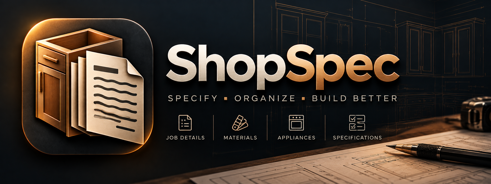

# ShopDocsV2

A Windows Forms desktop app for a cabinet shop to capture per-room job specs — cabinets, countertops, sinks, appliances, and more — then print, export, or hand them off to the shop's cabinet-design software as a `.ordx` file.

## Features

- **Schema-driven job forms.** Rooms are built dynamically from `questions.json`, so the shop's question set can be edited without touching code.
- **Catalog-backed dropdowns.** Materials, finishes, countertop colors, pulls, hardware colors, hinges, and guides are managed in a SQLite-backed Catalog Manager and reused across every job.
- **Autosave.** Edits are saved automatically (debounced) and flushed on close, so no explicit save step is required.
- **Print, copy, and export.** Print a job spec, copy a single room's specs to the clipboard, export the full job as `.txt`, or export a `.ordx` XML file for the shop's CV cabinet-design software.

## Getting started

```
dotnet build
dotnet test
dotnet run --project src/ShopDocsV2.WinForms
```

## Building the installer

`build-installer.ps1` publishes a self-contained `win-x64` build and packages it into a per-user MSI installer (no admin rights required to install):

```
.\build-installer.ps1
```

The resulting `ShopDocsV2Setup.msi` is written to `installer\ShopDocsV2.Installer\bin\Release\`. It installs to `%LocalAppData%\Programs\ShopDocsV2` with Start Menu and Desktop shortcuts, and shows up in Windows' "Apps & Features" for uninstall.

Building the MSI requires the [WiX Toolset](https://wixtoolset.org/) v6 CLI (`dotnet tool install --global wix --version 6.0.1`) — `build-installer.ps1` assumes it's already installed. (WiX v7 requires accepting a separate paid EULA, so this project pins to v6.)

## Project layout

| Project | Purpose |
| --- | --- |
| `ShopDocsV2.Domain` | Plain data model: jobs, rooms, question schema, catalog entries |
| `ShopDocsV2.Application` | Interfaces and pure business logic (spec formatting, print content, ORDX export) |
| `ShopDocsV2.Infrastructure` | SQLite persistence, `questions.json` loading, paint-color lookup |
| `ShopDocsV2.WinForms` | The WinForms UI shell |

See [CLAUDE.md](CLAUDE.md) for a deeper architecture walkthrough.
